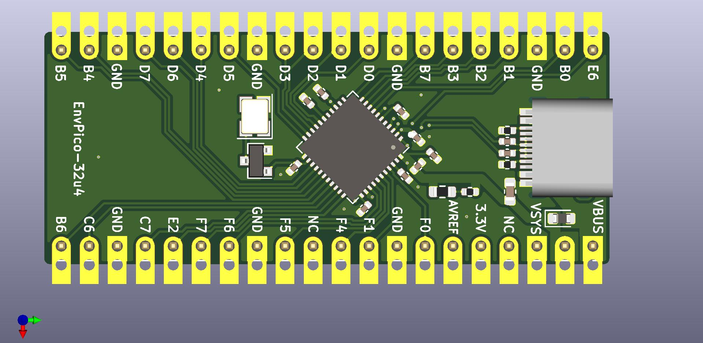

# EnvPico-32u4
Atmega32U4 board in the footprint of a Raspberry pi Pico, primarily inteded to be used for QMK

As you can imagine this is another kicad thing I just threw together on a whim but I did spend a bit more effort on this one and I might actually get this PCB made since I would like to get QMK properly running on my keyboards with VIA support.

Other than that it seems a bit easier to get Atmel chips over STM32s at the moment.

